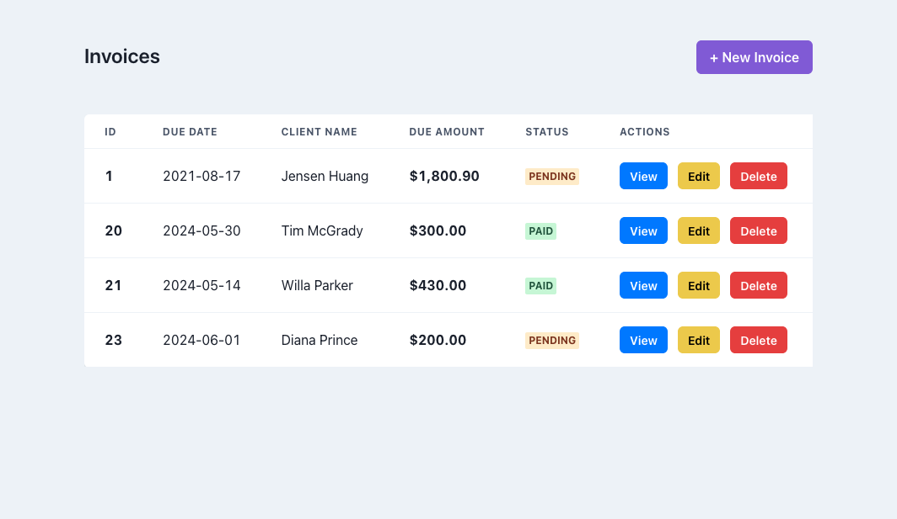
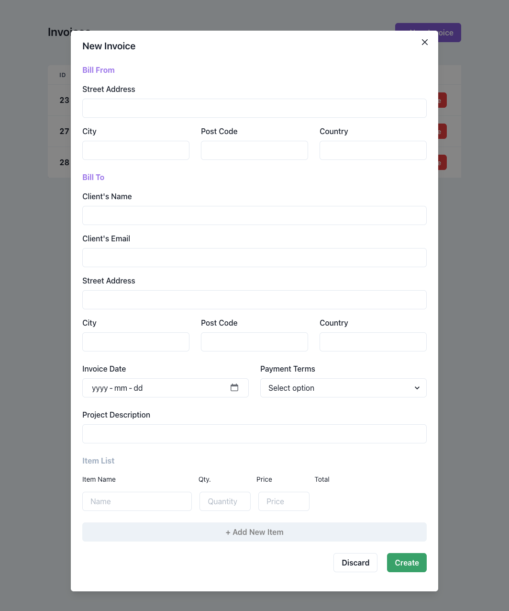
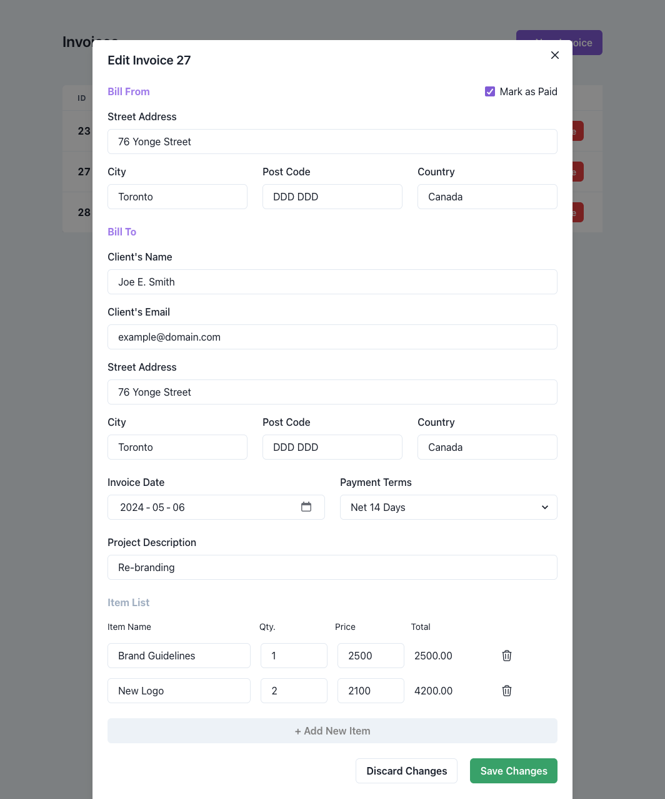
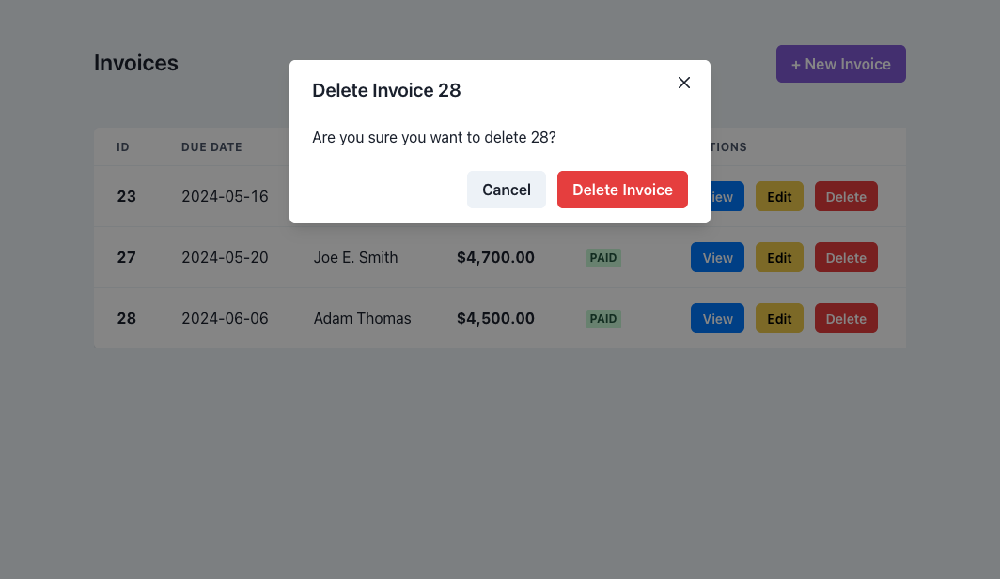
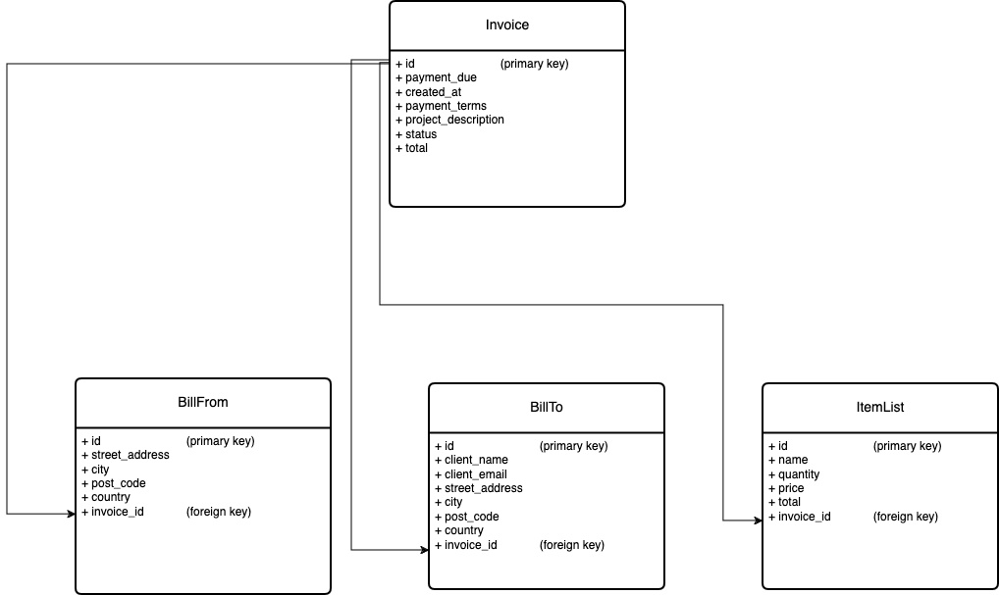

# Invoice CRUD App (React + Supabase Fullstack)

This is an invoice management app that allows users the create, view, update, and delete invoices. 

## Table of contents

- [Overview](#overview)
  - [Tech Stack](#tech-stack)
  - [Screenshots](#screenshots)
- [Backend](#backend)
  - [Database Schema Diagram](#database-schema-diagram)
  - [SQL CRUD Functions](#sql-crud-functions)
- [Useful resources](#useful-resources)

## Overview
It's built with React for the frontend and uses a Supabase database for the backend. React Context API is used for state management. Formik and Yup are used to manage and validate the forms.

###  Tech Stack
- React and ChakraUI for UI
- useContext for global state management
- Formik and Yup for  form management and validation
- Supabase for the database

### Screenshots

#### Create an Invoice

#### Edit an Invoice

#### Delete an Invoice

## Backend

### Database Schema Diagram
Before setting up the database in Supabase, I created a diagram to map out the table attributes and relationships according to the project requirements.

Invoice is the parent table, where BillFrom, BillTo, and ItemList have a foreign key reference to Invoice's id. Separating the entities of an invoice into separete tables is more faster than relying on array based properties

### SQL CRUD Functions
I took advantage of Supabase's Functions feature to write SQL functions to handle the complex CRUD operations such as creating, updating, and deleting invoices.

* To simplify the Delete function, I added a CASCADE foreign key constraint on invoice_id in tables BillFrom, BillTo, and ItemList. This way, when invoice is deleted, the database will delete any rows which has it's id. As a result, I wrote only one SQL DELETE command.

You can view the functions in: [crud.sql](https://github.com/semajthomasprimm/invoice-app-supabase-chakraui/blob/master/crud.sql)

## Useful Resources

- [The Complete Tutorial to Building a CRUD App with React.js and Supabase](https://adevait.com/react/building-crud-app-with-react-js-supabase)
- [Integrating Formik & Yup for React Form Validation](https://code.pieces.app/blog/react-form-validation-formik-yup)
- [An Introduction to Global State Management in React without a Library](https://coderpad.io/blog/development/global-state-management-react/)